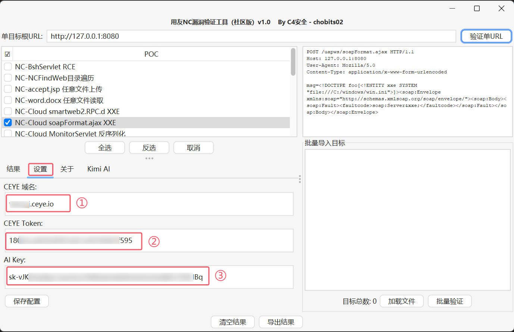
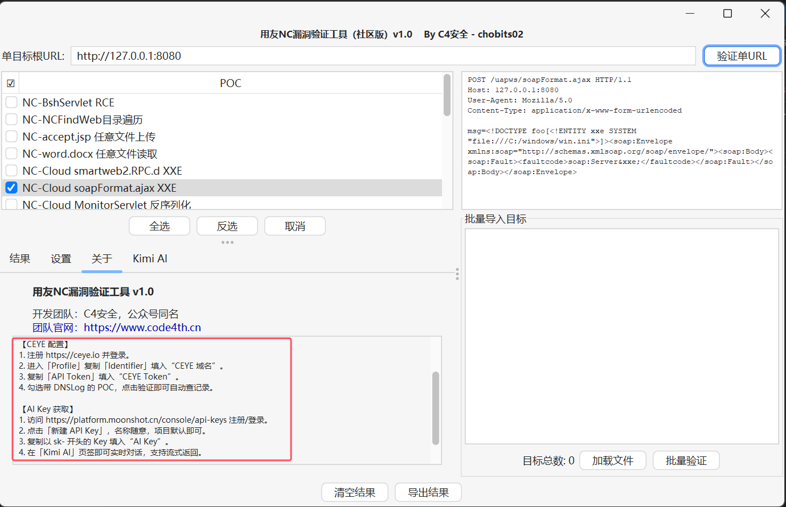
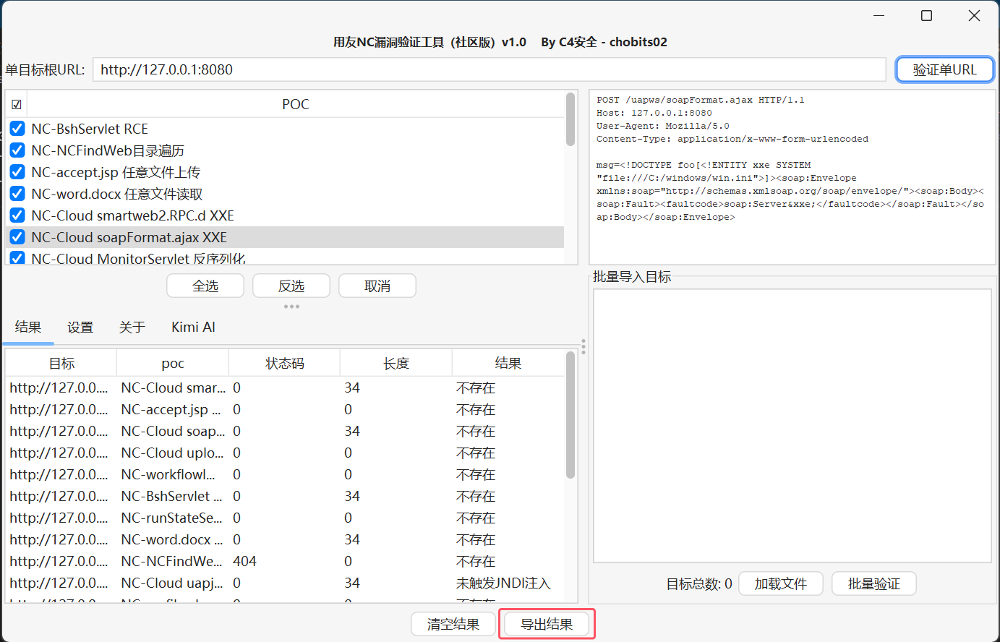
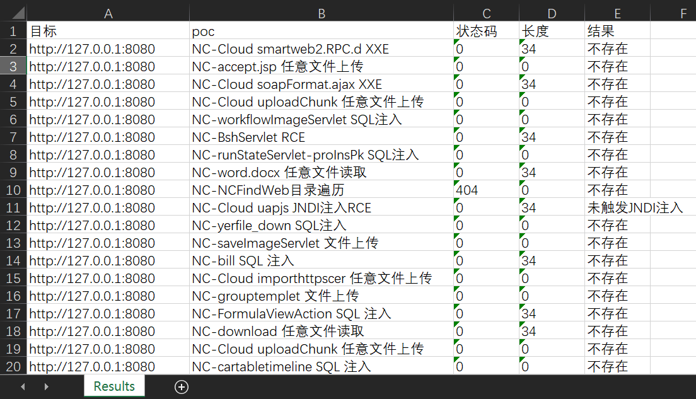

# 用友NC漏洞批量检测工具

  

用友NC系列漏洞检测利用工具，支持一键检测、命令执行回显、文件落地、一键打入内存马、文件读取等

> 免责声明：此工具仅限于安全研究，用户承担因使用此工具而导致的所有法律和相关责任！作者不承担任何法律责任！

## 🕳️ 目前已集成
* NC-BshServlet RCE
* NC-NCFindWeb目录遍历
* NC-accept.jsp 任意文件上传
* NC-word.docx 任意文件读取
* NC-Cloud smartweb2.RPC.d XXE
* NC-Cloud soapFormat.ajax XXE
* NC-Cloud MonitorServlet 反序列化
* NC-Cloud uapjs JNDI注入RCE
* NC-Cloud uploadChunk 任意文件上传
* NC-runStateServlet-proInsPk SQL注入
* NC-workflowImageServlet SQL注入
* NC-grouptemplet 文件上传
* NC-Cloud importhttpscer 任意文件上传
* NC-download 任意文件读取
* NC-saveImageServlet 文件上传
* NC-FormulaViewAction SQL 注入
* NC-bill SQL 注入
* NC-cartabletimeline SQL 注入
* NC-yerfile_down SQL注入
* NC-Cloud uploadChunk 任意文件上传

## ✨ 功能
###  单目标/多目标批量检测

### 设置ceye外带检测域名/Kimi AI key

### 配置说明

### 结果导出

## 🎯 后续更新
* 添加更多的POC
* 优化检测规则

## 交流

